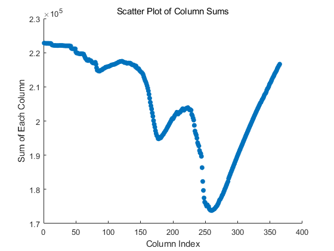
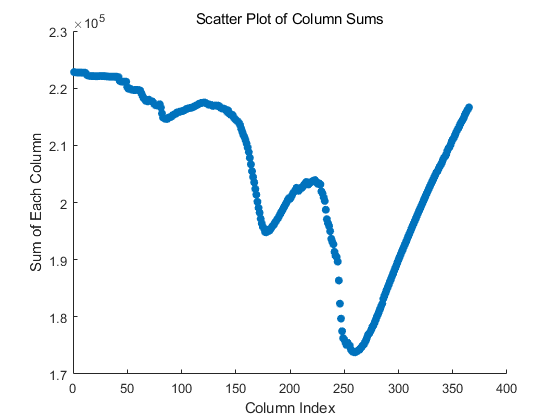
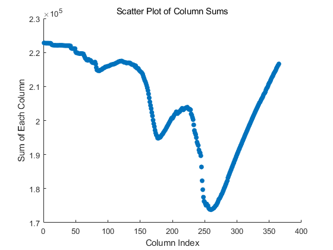

# CLUES-ABM Applications: Empirical Case Studies

## 1. Overview

This repository houses the empirical verification suite and dynamic policy scenario applications for the **CLUES-ABM** computational framework, **originally developed by the research team led by Prof. Shen Qu at the Beijing Institute of Technology**.

While the core matrix propulsion and agent micro-behavior routines are managed within the upstream [CLUES ABM Core](https://github.com/WaterAI-bit/CLUES_ABM) database, this application layer provides two independent, fully-functional language implementations—**Python** and **MATLAB**—to adapt to different research workflows.

---

## 2. Repository Architecture & Dual-Language Pipelines

The repository is split into two mirror-structured environments. Because the empirical datasets (such as high-resolution MRIO tracking tensors) are too large for standard git hosting, **the raw data files must be downloaded separately for each version via the instructions provided within their respective directories.**

### 🐍 Python Application Pipeline

* **Directory Root**: [`python/`](./python/)
* **Core Scripts**: Contains `example_1_ResourceConstraints.py`, `example_2_ReductionInProductionCapacity.py`, and `example_3_BlockageOffTransportationChain.py`.
* **Data Layer Setup**: 
  All operational Excel manifests belong in `python/data/`.
  
  > 💾 **Data & Preprocessing Instructions**:  
  > Please navigate to **`python/data/README.md`**. It provides:
  > 1. Website links to download the raw baseline **Input-Output Tables**.
  > 2. Standardized `data_preprocessing.py` required to make raw tables compatible with the Python core engine.

---

### 🎛️ MATLAB Application Pipeline

* **Directory Root**: [`matlab/`](./matlab/)
* **Core Scripts**: Contains `example_1_ResourceConstraints.m`, `example_2_ReductionInProductionCapacity.m`, , and `example_3_BlockageOffTransportationChain.m`.
* **Data Layer Setup**: 
  All operational Excel manifests belong in  `matlab/data/`.
  
  > 💾 **Data & Preprocessing Instructions**:  
  > Please navigate to **`python/data/README.md`**. It provides:
  > 1. Website links to download the raw baseline **Input-Output Tables**.
  > 2. Standardized `data_preprocessing.m` required to make raw tables compatible with the Matlab core engine.

---

## 3. Multi-Scale Case Matrix & Execution Scenarios

Across both language environments, the application layer decouples systemic risks into three distinct validation channels, matching explicit industrial and logistical data topologies:

* **💧 Case 1: Resource Constraints**  
  Simulates urban-level economic exposure under rigid water-scarcity limits or energy dual-control caps across **309 Chinese cities**. Uses `WaterVariables.xlsx` to scale factory-level adaptive factor inputs.

* **⚙️ Case 2: Production Capacity Reductions**  
  Quantifies cascading supply chain losses and regional value-added recoveries following policy-driven enterprise shutdowns or localized manufacturing asset degradation.

* **🚚 Case 3: Transportation Blockages**  
  Maps out global macroeconomic vulnerability and buffer depletion rates when strategic shipping lanes (e.g., the Suez Canal obstruction) face sudden transit delays across **189 countries**.

---

## 4. Academic Citation

If you adapt these scenario scripts, deploy the input matrices, or build upon these specific empirical case settings in your academic work, please cite our corresponding foundational publications:

1.  Qi Zhou, Shen Qu*, Miaomiao Liu, Jianxun Yang, Jia Zhou, Yunlei
    She, Zhouyi Liu, Jun Bi. Enhancing the Efficiency of Enterprise
    Shutdowns for Environmental Protection: An Agent-Based Modeling
    Approach with High Spatial--Temporal Resolution Data, *Engineering*,
    2024, 42: 295-307. <https://doi.org/10.1016/j.eng.2024.02.006>
2.  Shen Qu*, Yunlei She, Qi Zhou*, Jasper Verschuur, Lu-Tao Zhao, Huan Liu, Ming Xu, Yi-Ming Wei. Modeling the Dynamic Impacts of the Maritime Network Blockage on Global Supply Chains. The Innovation, 2024, 5(4): 100653<https://doi.org/10.1016/j.xinn.2024.100653>.
3.  Qianzi Wang, Qi Zhou*, Jin Lin, Sen Guo, Yunlei She, Shen Qu*.
    Risk assessment of power outages to inter-regional supply chain
    networks in China, *Applied Energy*, 2023, 353: 122100.
    <https://doi.org/10.1016/j.apenergy.2023.122100>
4.  Yunlei She, Jiayang Chen, Qi Zhou, Liping Wang, Kai Duan, Ranran
    Wang, Shen Qu*. Evaluating losses from water scarcity and benefits of
    water conservation measures to intercity supply chains in China,
    *Environmental Science & Technology*, 2024, 58(2): 1119-1130.
    <https://doi.org/10.1021/acs.est.3c09015>

---

## 5. Expected Simulation Results

When you run the standalone workflow above, the core matrix engine dynamically tracks the multi-regional spatiotemporal cascading losses. The compiled metrics and topological network resilience curves are automatically rendered and archived into the `docs/` directory as `example_1_plot.png`, `example_2_plot.png`, and `example_3_plot.png`.

Below is the verified timeline response capturing the system's macroeconomic output fluctuations under targeted regional capacity shocks:

  
   
  <em>Figure: Value-added recovery and resilience trajectory under Example 1: Resource constraints.</em>

  
   
  <em>Figure: Value-added recovery and resilience trajectory under Example 2: Production capacity reduction.</em>

  
   
  <em>Figure: Value-added recovery and resilience trajectory under Example 3: Transportation blockage.</em>

